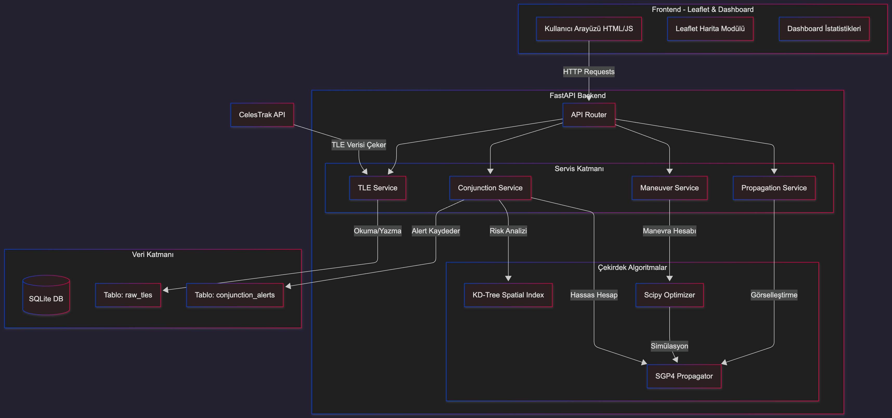
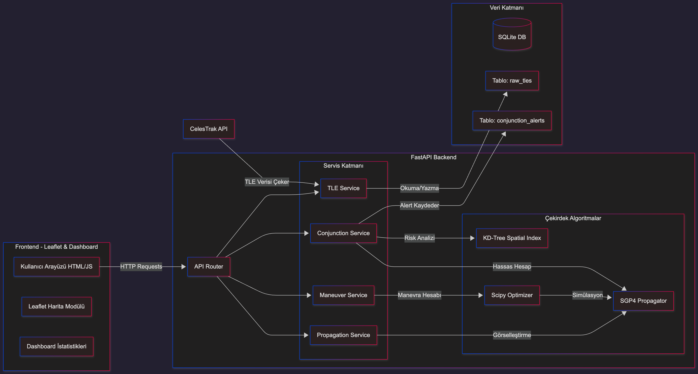
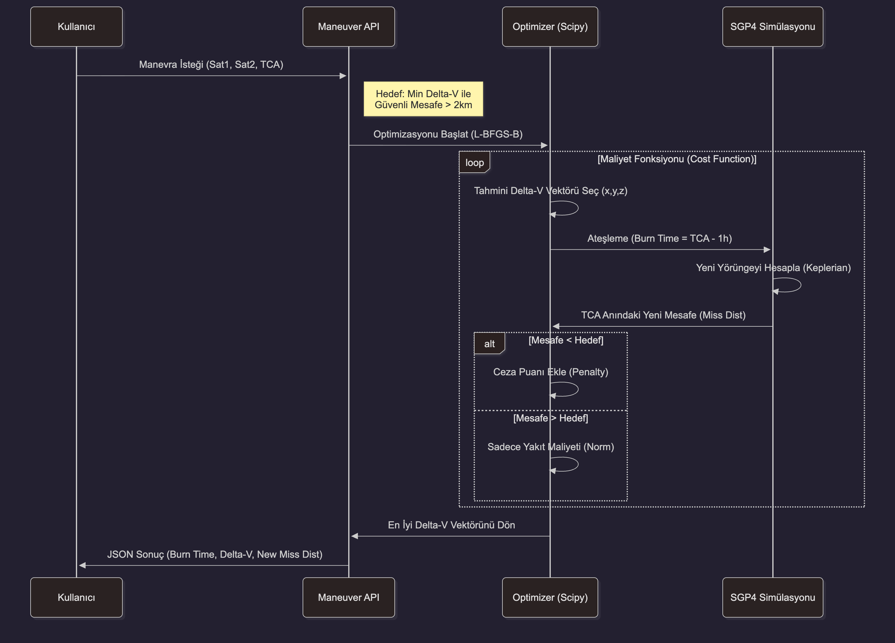
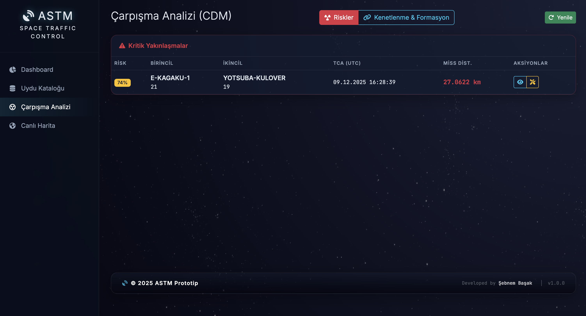
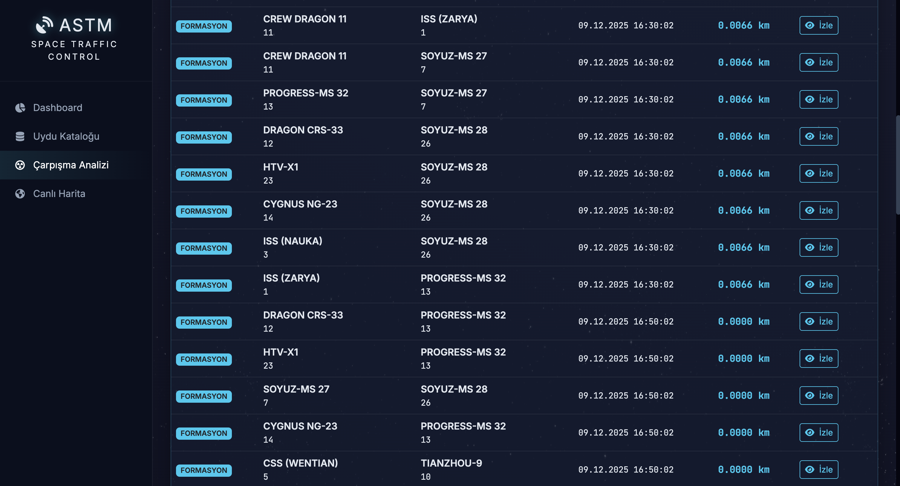
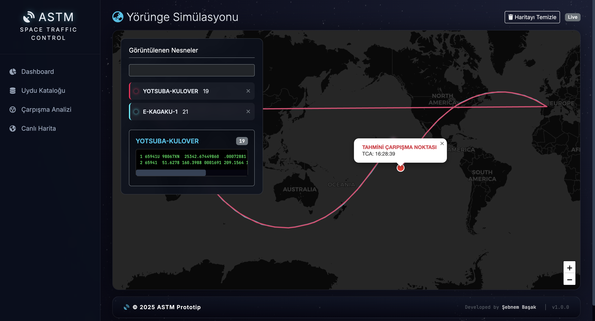
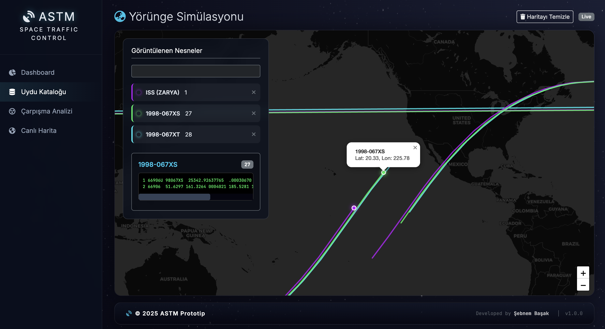

# ASTM-PROTOTYPE: Uzay Trafik Kontrol ve Çarpışma Yönetimi

Bu proje Alçak Dünya Yörüngesi (LEO) uydularının çarpışma risklerini (Conjunction Assessment) yönetmek ve optimal kaçınma manevralarını planlamak için geliştirilmiş bir sistemdir.
Backend, hesaplama yoğunluklu uzay mekaniği görevlerini yöneten FastAPI üzerine kurulmuştur. Frontend ise etkileşimli bir Dashboard, Uydu Kataloğu ve Canlı Harita Görselleştirmesi sunan modern bir HTML/JavaScript arayüzüdür.


## Temel Özellikler

### Backend

* **Çarpışma Tarama (Conjunction Screening):**
    * **Broad Phase:** Uyduları coğrafi olarak gruplayarak (KD-Tree ile O(N logN)) potansiyel çarpışma adaylarını hızla eler/budar (`processing/pruner.py`).
    * **Narrow Phase:** Kalan aday çiftler için SGP4 modeli ve Skalar Optimizasyon (Bisection/Brent) kullanarak En Yakın Geçiş Zamanı (TCA) ve En Kısa Mesafe'yi (Miss Distance) hassas bir şekilde hesaplar.
* **Manevra Optimizasyonu (Maneuver Optimization):**
    * Çarpışma riskini azaltmak için gereken minimum DeltaV (yakıt maliyeti) vektörünü bulmak için kısıtlanmış L-BFGS-B (Box-Constrained Broyden–Fletcher–Goldfarb–Shanno) algoritmasını kullanır.
    * Manevra, TCA'dan belirli bir süre önce (örneğin 1 saat) yapılan anlık (impulsive) bir hız değişimi olarak modellenir.
* **Veri Yönetimi:** SQLite veritabanı kullanarak TLE verilerini ve çarpışma uyarılarını kaydeder.

### Frontend

* **Canlı Harita Görünümü:** Leaflet.js haritası üzerinde, seçilen uyduların SGP4 ile hesaplanmış yörünge yollarını (Lat/Lon/Alt) görselleştirir.
* **Çarpışma Analizi Arayüzü:** Kritik Riskler (`COLLISION`) ve Yakın Formasyon Uçuşları/Kenetlenmeler (`DOCKING`) olaylarını ayırarak görüntüler.
* **Manevra Planlama Modalı:** Seçilen bir çarpışma uyarısı için, hedeflenen güvenli mesafeye ulaşmak için gereken optimal DeltaV değerlerini gösteren etkileşimli bir arayüz sunar.

### ASTM-Demo Örneği


## Kurulum ve Çalıştırma

### Gereksinimler

* Python 3.10+
* Git

### Adımlar

1.  **Projeyi Klonlama:**
    ```bash
    git clone https://github.com/sebnembasak/astm-prototype
    cd astm-prototype
    ```

2.  **Sanal Ortam Oluşturma ve Bağımlılıkları Yükleme:**
    ```bash
    # Sanal ortamı oluştur ve etkinleştir
    python -m venv .venv
    source .venv/bin/activate
    
    # Bağımlılıkları yükle
    pip install -r requirements.txt
    ```

3.  **Veritabanını Başlatma:**
    Veritabanı tablolarını (`raw_tles`, `conjunction_alerts`) oluşturur.
    ```bash
    python backend/models/db.py
    # Çıktı: Veritabanı tabloları başarıyla oluşturuldu/güncellendi.
    ```

4.  **TLE Verilerini Çekme (İlk Yükleme):**
    Celestrak'tan güncel uydu verilerini çeker ve yerel veritabanına kaydeder.
    ```bash
    python ingest/tle_fetcher.py
    ```

5.  **API Sunucusunu Başlatma:**
    Uvicorn ile FastAPI uygulamasını çalıştırın.
    ```bash
    uvicorn main:app --reload
    ```
    Sunucu varsayılan olarak `http://127.0.0.1:8000` adresinde başlayacaktır.

### Erişilebilirlik

* **Web Arayüzü:** `http://127.0.0.1:8000/index.html`
* **API Dokümantasyonu (Swagger UI):** `http://127.0.0.1:8000/docs`

## Temel Hesaplama Modülleri

| Modül | Dosya Yolu | Sorumluluk                                                                                             |
| :--- | :--- |:-------------------------------------------------------------------------------------------------------|
| **SGP4 Propagatör** | `processing/propagator.py` | TLE'den alınan yörüngeyi belirli bir zamana kadar ilerletir (r ve v vektörlerini TEME'de verir).       |
| **Koordinat Dönüşümü** | `processing/coord_utils.py` | TEME (uzay) koordinatlarını haritada çizmek için Lat/Lon/Alt (Dünya yüzeyi) değerlerine çevirir        |
| **Budama (Pruner)** | `processing/pruner.py` | **cKDTree** kullanarak binlerce uydu arasından sadece birbirine yakın olan aday çiftleri hızlıca seçer |
| **Manevra Optimizasyonu** | `planner/optimizer.py` | **Scipy.optimize** kullanarak çarpışma sonrası güvenli mesafeyi sağlayan minimum DeltaV değerini bulur |

## Proje Yapısı

Proje, Servis Katmanı Mimarisi (Service Layer Architecture) kullanılarak tasarlanmıştır.

| Dizin | Amaç                                                                                                      |
| :--- |:----------------------------------------------------------------------------------------------------------|
| **backend/api** | FastAPI router'ları, HTTP isteklerini (`router_*.py`) işler                                               |
| **service** | İş mantığı katmanı. API ile çekirdek hesaplama (`processing`, `planner`) modüllerini bağlar               |
| **processing** | Çekirdek uzay mekaniği ve matematiksel hesaplamalar (SGP4, koordinat dönüşümü, budama, çarpışma analizi). |
| **planner** | Optimizasyon motorunu ve manevra hesaplama algoritmalarını içerir.                                        |
| **ingest** | Harici veri kaynaklarından (Celestrak) veri çekme işlemleri (`tle_fetcher.py`).                           |
| **backend/models** | Veritabanı şemaları ve bağlantı ayarları (`db.py`).                                                       |
| **main.py** | FastAPI uygulamasının ana giriş noktası.                                                                  |
| **assets/** | CSS, JS ve görsel dosyaları.                                                                              |

## Diyagramlar
### Sistem Mimarisi Diyagramı:


### Çarpışma Analizi Mimarisi Diyagramı:


### Manevra Analizi Diyagramı:


Sistem hakkında detaylı bilgiye ```docs``` klasörü altındaki ```astm-rapor.pdf``` dosyasından ulaşabilirsiniz.


## Ekran Görüntüleri
### Dashboard:


### Katalog:


### Çarpışma Analizi:


### Kenetlenme:


### Çarpışma Simülasyonu:


### Manevra Optimizasyonu:


### Yörünge Simülasyonu:
