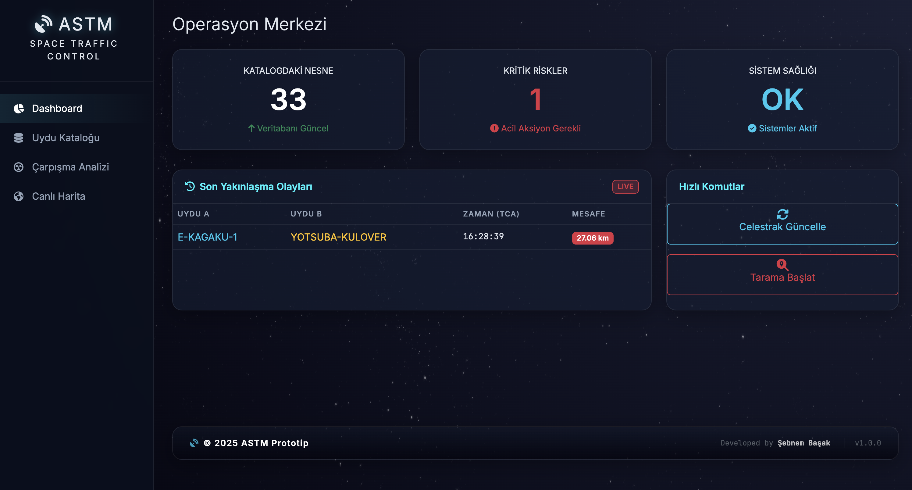
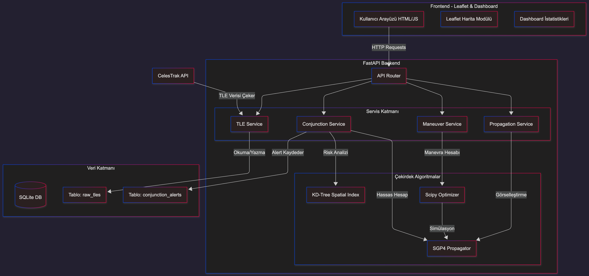
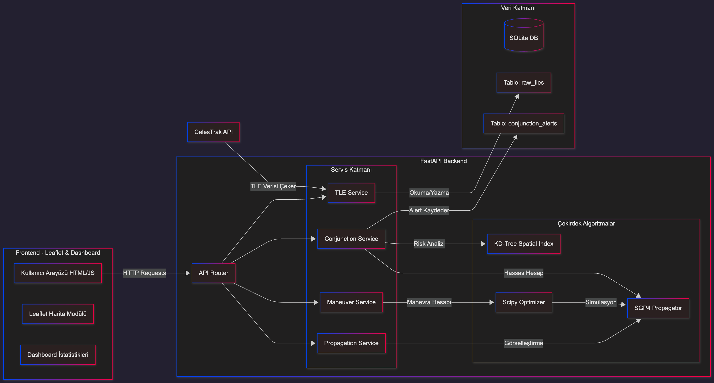
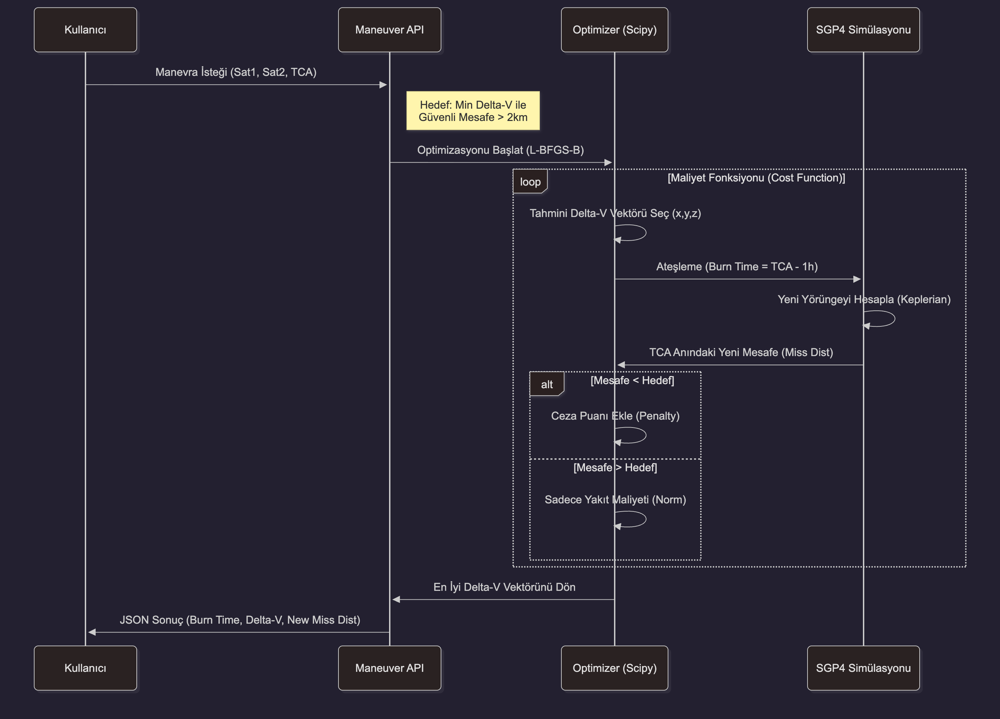
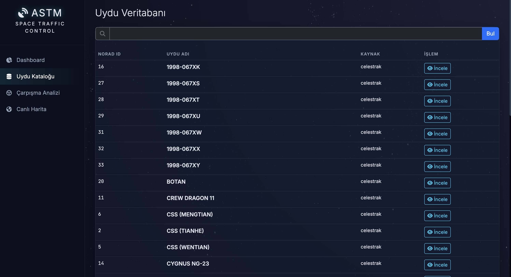
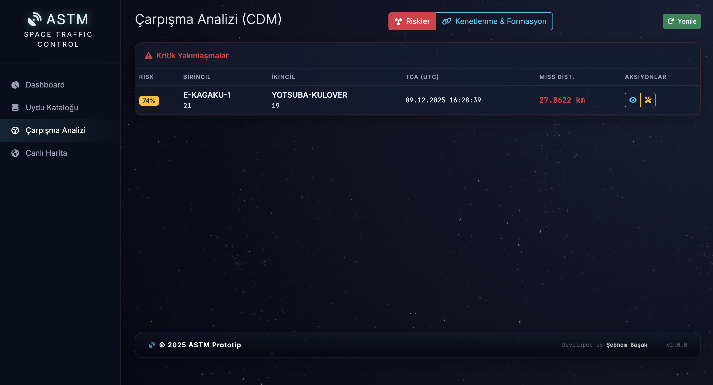
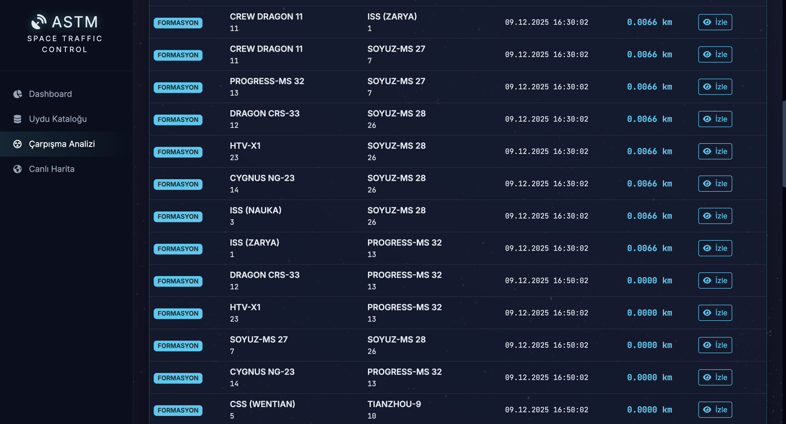
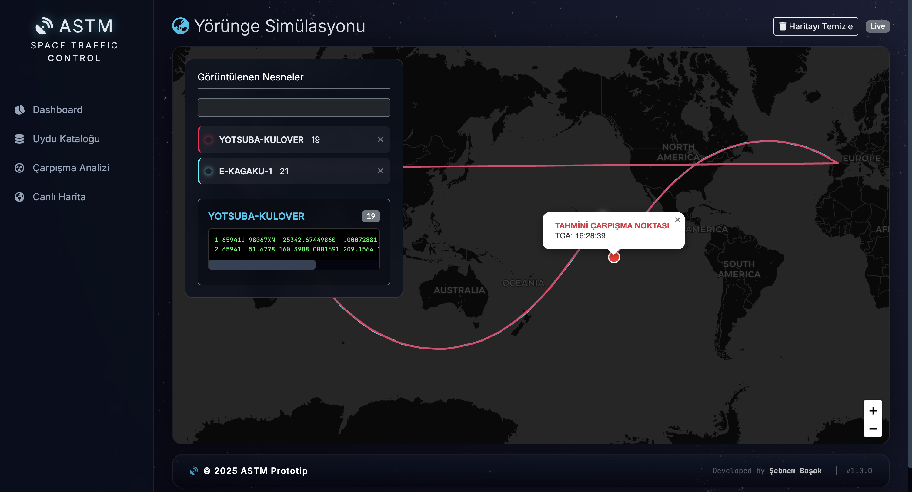
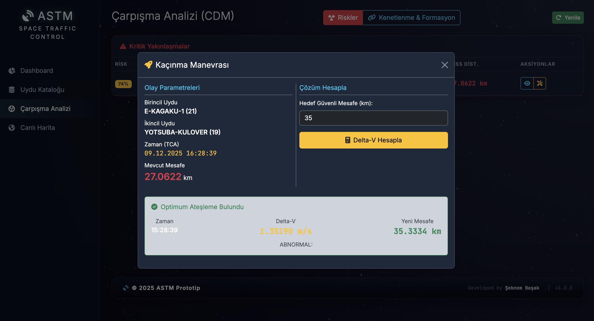
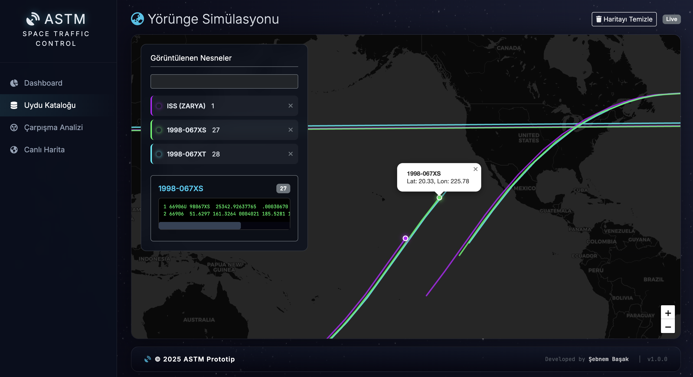

# ASTM-PROTOTYPE: Uzay Trafik Kontrol ve Çarpışma Yönetimi

**<em>Bu proje Türkiye Uzay Ajansı'nın Milli Uzay Programı'nda belirtilen 'Uzay Nesnelerinin Yerden Gözlemi ve Takibi' (Hedef 7) stratejisi doğrultusunda; ülkemizin uzay trafik yönetimi alanındaki yazılım kabiliyetini artırmak, yerli ve milli karar destek mekanizmaları geliştirmek amacıyla tasarlanmış bir Ar-Ge prototipidir.</em>**

Proje; Alçak Dünya Yörüngesi (LEO) uydularının çarpışma risklerini (Conjunction Assessment) yönetmek ve optimal kaçınma manevralarını planlar. 
Backend, hesaplama yoğunluklu uzay mekaniği görevlerini yöneten FastAPI üzerine kurulmuştur. 
Frontend ise etkileşimli bir Dashboard, Uydu Kataloğu ve Canlı Harita Görselleştirmesi sunan modern bir HTML/JavaScript arayüzüdür.


## Temel Özellikler

### Backend

* **Çarpışma Tarama (Conjunction Screening):**
    * **Broad Phase:** Uyduları coğrafi olarak gruplayarak (KD-Tree ile O(N logN)) potansiyel çarpışma adaylarını hızla eler/budar (`processing/pruner.py`).
    * **Narrow Phase:** Kalan aday çiftler için SGP4 modeli ve Skalar Optimizasyon (Bisection/Brent) kullanarak En Yakın Geçiş Zamanı (TCA) ve En Kısa Mesafe'yi (Miss Distance) hassas bir şekilde hesaplar.
* **Manevra Optimizasyonu (Maneuver Optimization):**
    * Çarpışma riskini azaltmak için gereken minimum DeltaV (yakıt maliyeti) vektörünü bulmak için kısıtlanmış L-BFGS-B (Box-Constrained Broyden–Fletcher–Goldfarb–Shanno) algoritmasını kullanır.
    * Manevra, TCA'dan belirli bir süre önce (örneğin 1 saat) yapılan anlık (impulsive) bir hız değişimi olarak modellenir.
* **Veri Yönetimi:** SQLite veritabanı kullanarak TLE verilerini ve çarpışma uyarılarını kaydeder.

### Yapay Zeka ve SSA (Uzay Durum Farkındalığı) Modülü
Sistem, ham TLE verilerini kullanarak uyduların davranışlarını ve gizli görev parametrelerini analiz eden bir Makine Öğrenmesi (ML) katmanı içerir:

* **Görev Sınıflandırma (Calibrated Random Forest):** 7.500+ uyduluk UCS veri seti ile eğitilen model; eğim, basıklık, periyot, perije ve apoje verilerinden (Kepler'in 3. Kanunu ile türetilmiş) uydunun kullanım amacını ~%90 doğrulukla tahmin eder. Ham olasılık çıktıları `CalibratedClassifierCV` (sigmoid, çapraz doğrulamalı) ile kalibre edilerek güven (confidence) skorlarının gerçek isabet oranını yansıtması sağlanır.
* **Anomali Tespiti (Isolation Forest + Local Outlier Factor Ensemble):** Isolation Forest global/eksen-hizalı aykırılıkları, Local Outlier Factor (LOF) ise yoğun bir kümenin içindeki lokal aykırılıkları yakalar; iki yöntemden biri anomali derse nesne işaretlenir (OR mantığı, kaçırılan gerçek bir anomalinin maliyetinin fazladan bir uyarıdan daha yüksek olduğu prensibiyle).
* **Yörünge Rejimi Kümeleme (Gaussian Mixture Model):** Uyduları fiziksel özelliklerine göre LEO, MEO, GEO, HEO ve VLEO olarak 5 ana kümede gruplandırır; K-Means'in sert (hard) küme sınırları yerine olasılıksal (soft) üyelik ataması kullanır.
* **Manevra Tespiti (Mean-Element Farkı):** `tle_history` tablosunda arşivlenen ardışık TLE çiftlerinden mean orbital elementleri (yarı-büyük eksen, eğim, dış merkezlik) faz/mean-anomaly bilgisinden bağımsız olarak çıkarır; aradaki farktan tanjantsal ve normal ΔV bileşenlerini fizik formülüyle (dairesel yörünge yaklaşımı) türeterek İrtifa Değişimi, Düzlem Değişimi, Eksantriklik Değişimi veya Kombine manevra tiplerini sınıflandırır.
* **Sönümlenme (Decay) Analizi:** BSTAR sürüklenme katsayısı ve irtifa verilerini hibritleyerek uydunun atmosfere düşme riskini (Düşük/Orta/Yüksek) hesaplar.
* **Teknik Performans Raporu:** Modelin başarı metriklerini (Accuracy, F1-Score, ROC-AUC, Confusion Matrix) radar grafikler ve ısı haritaları ile anlık olarak sunar.

### Yer İstasyonu Planlama & Kapasite Analizi (Ground Station Scheduling)
Büyüyen pocketqube/IoT uydu constellation'ları (örn. Hello Space) için, sınırlı yer istasyonu sayısıyla artan uydu sayısı arasındaki operasyonel darboğazı modeller:

* **AOS/LOS Hesabı:** Mevcut SGP4 propagasyon altyapısını (`processing/propagator.py`) yer istasyonuna göre topocentric elevasyon açısına (AltAz dönüşümü) genişletir; bir uydunun istasyon üzerinden geçiş penceresini (Acquisition/Loss of Signal) ve maksimum elevasyonunu hesaplar.
* **Çakışma Tespiti:** Aynı istasyonda zaman içinde örtüşen geçiş pencerelerini ve çakışma oranını tespit eder.
* **İstasyon-Bağımlı EFT Greedy Çizelgeleme:** Her geçiş penceresi kendi istasyonunun geometrisine bağlı olduğundan, çizelgeleme istasyon başına bağımsız bir tek-kaynak (single-resource) problemi olarak Earliest-Finish-Time greedy algoritmasıyla çözülür (tek kaynak için ispatlanmış optimal).
* **Kapasite Planlama Senaryoları:** Hello Space'in 525km/97.5° SSO yörünge profiline yakın **gerçek** Celestrak nesneleri (`tle_service.get_satellites_by_orbit_profile`, debris/ISS gibi alakasız yörünge aileleri elenerek) kullanılarak, 3/10/30/80 uydu × 1/2/3 istasyon ızgarasında kapasite kaybını (kaçırılan geçiş oranı) karşılaştırır ve "kaybı %50 azaltmak için kaç ek istasyon gerekir" sorusuna geriye-doğru arama ile cevap üretir.

#### Bulgu: Kutup İstasyonu Darboğazı
Bu senaryolardan çıkan en önemli sonuç: **istasyon eklemek kapasiteyi otomatik artırmıyor.** SSO/polar yörüngeli (97.5° inklinasyon) uydular, kutup-bölgesi istasyonlarından (örn. Svalbard, 78°N) her turda görülür (günde ~10-15 kez), orta enlemden (örn. Ankara, 40°N) ise sadece birkaç kez. Yeni eklenen istasyon da yüksek-görünürlük (kutup) bölgesindeyse, kapasiteden çok talebi büyütüp mevcut darboğazı genişletebiliyor:

| Uydu | 1 İstasyon | 2 İstasyon (+Svalbard) | 3 İstasyon (+Punta Arenas) |
|:---:|:---:|:---:|:---:|
| 25 | %37.8 kayıp | **%52.8 kayıp** | %50.0 kayıp |
| 80 | %54.6 kayıp | **%73.3 kayıp** | %70.0 kayıp |

Gerçek dünyada SSO ağırlıklı yer gözlem operatörleri (Planet Labs, ICEYE benzeri) bu nedenle kutup/yarı-kutup bölgesinde çoklu istasyon veya yüksek-verim yer segmentine yatırım yapar. Detaylı analiz ve tam senaryo tablosu: [RELEASE.md](RELEASE.md#bulgu-kutup-istasyonu-darboğazı).

#### Veri ve Varsayımlar Şeffaflığı
| Parametre | Etiket |
|---|---|
| TLE verisi | **Gerçek** (Celestrak `stations`/`visual`/`debris`/`resource`, canlı fetch) |
| Senaryo uydu seçimi | **Gerçek veri**, Hello Space'in SSO profiline en yakın nesneler — Hello Space'in kendi constellation'ı değil, benzer yörünge fiziğine sahip gerçek nesneler |
| İstasyon koordinatları | **Gerçek koordinat**, varsayımsal aday havuzu (fiilen kurulu istasyon iddiası yok) |
| `min_elevation_deg=10°` | **Mühendislik varsayımı**, SATCOM endüstri pratiğine uygun (ITU-R P.618), Hello Space'e özgü kalibre edilmemiş |
| Tarama adımı / senaryo süresi / uydu sayıları | **Mühendislik varsayımları** (performans-hassasiyet dengesi, günlük döngü, büyüme tahmini) |

Tam tablo ve gerekçeler: [RELEASE.md](RELEASE.md#veri-ve-varsayımlar-şeffaflığı).

### Frontend

* **Canlı Harita Görünümü:** Leaflet.js haritası üzerinde, seçilen uyduların SGP4 ile hesaplanmış yörünge yollarını (Lat/Lon/Alt) görselleştirir.
* **Çarpışma Analizi Arayüzü:** Kritik Riskler (`COLLISION`) ve Yakın Formasyon Uçuşları/Kenetlenmeler (`DOCKING`) olaylarını ayırarak görüntüler.
* **Manevra Planlama Modalı:** Seçilen bir çarpışma uyarısı için, hedeflenen güvenli mesafeye ulaşmak için gereken optimal DeltaV değerlerini gösteren etkileşimli bir arayüz sunar.
* **Manevra Tespiti Paneli:** Katalogdaki uydular için otomatik taranan geçmiş manevra olaylarını (tip, Δa/Δi/Δe, tahmini ΔV, güven skoru) listeler.
* **Canlı Yörünge Yenileme:** Haritadaki uydu işaretçisi, 100 dakikalık hesaplama penceresinin sonuna yaklaştığında arka planda otomatik olarak yeni bir yörünge parçası çekerek kesintisiz takip sağlar.

### ASTM-Demo Örneği
[](https://vimeo.com/1145363572)
> *Demoyu izlemek için yukarıdaki görsele tıklayınız.*
Demo videosuna ve rapora ```docs``` dizininden ulaşabilirsiniz. Demo videosunu görüntülemek için ```view raw``` seçeneğine basıp videoyu indirebilirsiniz.

## Kurulum ve Çalıştırma

### Gereksinimler

* Python 3.10+
* Git

### Adımlar

1.  **Projeyi Klonlama:**
    ```bash
    git clone https://github.com/sebnembasak/astm-prototype
    cd astm-prototype
    ```

2.  **Sanal Ortam Oluşturma ve Bağımlılıkları Yükleme:**
    ```bash
    # Sanal ortamı oluştur ve etkinleştir
    python -m venv .venv
    source .venv/bin/activate
    
    # Bağımlılıkları yükle
    pip install -r requirements.txt
    ```

3.  **Veritabanını Başlatma:**
    Veritabanı tablolarını (`raw_tles`, `conjunction_alerts`) oluşturur.
    ```bash
    python backend/models/db.py
    # Çıktı: Veritabanı tabloları başarıyla oluşturuldu/güncellendi.
    ```

4.  **TLE Verilerini Çekme (İlk Yükleme):**
    Celestrak'tan güncel uydu verilerini çeker ve yerel veritabanına kaydeder.
    ```bash
    python ingest/tle_fetcher.py
    ```

5.  **API Sunucusunu Başlatma:**
    Uvicorn ile FastAPI uygulamasını çalıştırın.
    ```bash
    uvicorn main:app --reload
    ```
    Sunucu varsayılan olarak `http://127.0.0.1:8000` adresinde başlayacaktır.

### Erişilebilirlik

* **Web Arayüzü:** `http://127.0.0.1:8000/`
* **API Dokümantasyonu (Swagger UI):** `http://127.0.0.1:8000/docs`

## Temel Hesaplama Modülleri

| Modül | Dosya Yolu | Sorumluluk                                                                                             |
| :--- | :--- |:-------------------------------------------------------------------------------------------------------|
| **SGP4 Propagatör** | `processing/propagator.py` | TLE'den alınan yörüngeyi belirli bir zamana kadar ilerletir (r ve v vektörlerini TEME'de verir).       |
| **Koordinat Dönüşümü** | `processing/coord_utils.py` | TEME (uzay) koordinatlarını haritada çizmek için Lat/Lon/Alt (Dünya yüzeyi) değerlerine çevirir        |
| **Budama (Pruner)** | `processing/pruner.py` | **cKDTree** kullanarak binlerce uydu arasından sadece birbirine yakın olan aday çiftleri hızlıca seçer |
| **Manevra Optimizasyonu** | `planner/optimizer.py` | **Scipy.optimize** (L-BFGS-B) kullanarak çarpışma sonrası güvenli mesafeyi sağlayan minimum DeltaV değerini bulur |
| **Manevra Tespiti** | `processing/maneuver_detection.py` | Ardışık TLE'lerin mean orbital elementlerinden (faz-bağımsız) fizik tabanlı ΔV tahminiyle geçmiş manevraları tespit eder |
| **Yer İstasyonu Görüş Geometrisi** | `processing/ground_station.py` | TEME konumundan topocentric elevasyon açısı hesaplar, AOS/LOS geçiş pencerelerini bulur |
| **Çakışma Tespiti (İstasyon)** | `processing/schedule_conflict.py` | Aynı istasyonda zaman içinde örtüşen geçiş pencerelerini ve çakışma oranını tespit eder |
| **Yer İstasyonu Çizelgeleme** | `planner/ground_scheduler.py` | İstasyon-bağımlı Earliest-Finish-Time greedy algoritmasıyla çakışan geçişler arasından atama yapar |

## Test ve Doğrulama

Çekirdek uzay mekaniği modülleri (`processing/conjunction.py`, `planner/optimizer.py`) için `tests/` dizininde deterministik birim testleri bulunur. Testler, gerçek SGP4/poliastro çağrıları yerine doğrusal hareket varsayan sahte (mock) propagator fonksiyonları kullanarak el ile doğrulanabilir kapalı-form sonuçlar üzerinden çalışır:

```bash
pytest tests/ -v
```

## Proje Yapısı

Proje, Servis Katmanı Mimarisi (Service Layer Architecture) kullanılarak tasarlanmıştır.

| Dizin | Amaç                                                                                                      |
| :--- |:----------------------------------------------------------------------------------------------------------|
| **backend/api** | FastAPI router'ları, HTTP isteklerini (`router_*.py`) işler                                               |
| **service** | İş mantığı katmanı. API ile çekirdek hesaplama (`processing`, `planner`) modüllerini bağlar               |
| **processing** | Çekirdek uzay mekaniği ve matematiksel hesaplamalar (SGP4, koordinat dönüşümü, budama, çarpışma analizi). |
| **planner** | Optimizasyon motorunu ve manevra hesaplama algoritmalarını içerir.                                        |
| **ingest** | Harici veri kaynaklarından (Celestrak) veri çekme işlemleri (`tle_fetcher.py`).                           |
| **backend/models** | Veritabanı şemaları ve bağlantı ayarları (`db.py`).                                                       |
| **main.py** | FastAPI uygulamasının ana giriş noktası.                                                                  |
| **assets/** | CSS, JS ve görsel dosyaları.                                                                              |

## Diyagramlar
### Sistem Mimarisi Diyagramı:


### Çarpışma Analizi Mimarisi Diyagramı:


### Manevra Analizi Diyagramı:


Sistem hakkında detaylı bilgiye ```docs``` klasörü altındaki ```astm-rapor.pdf``` dosyasından ulaşabilirsiniz.


## Ekran Görüntüleri
### Dashboard:


### Katalog:


### Çarpışma Analizi:


### Kenetlenme:


### Çarpışma Simülasyonu:


### Manevra Optimizasyonu:


### Yörünge Simülasyonu:

