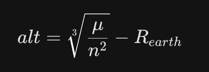

# Release Notes - v1.1.0 (SSA Intelligence Update)

## Genel Bakış
Bu sürüm, ASTM platformuna **Uzay Durum Farkındalığı (SSA)** yeteneklerini getiren kapsamlı bir Yapay Zeka güncellemesidir. Artık sistem sadece uyduların nerede olduğunu değil, **ne amaçla orada olduklarını** ve **normal davranıp davranmadıklarını** analiz edebilmektedir.

## Teknik Spesifikasyonlar

### 1. Yörünge Mekaniği ve Fiziksel Parametreler
Sistem, ham TLE (Two-Line Element) verilerinden türetilen fiziksel büyüklükleri temel alır.

- **İrtifa (Altitude) Hesaplaması:** Uydunun ortalama irtifası, Kepler'in Üçüncü Yasası'ndan türetilen aşağıdaki formülle hesaplanmaktadır:
    
  - Burada μ (mu) (Dünya'nın kütleçekim parametresi) 398600.44 km^3/s^2, 
  - n radyan/saniye cinsinden ortalama hareket (Mean Motion)
  - R_earth ise 6378.137 km olarak kabul edilmiştir.

- **BSTAR Sürüklenme Katsayısı:** TLE Line 1 içerisinden ayrıştırılan bu değer, uydunun atmosferik dirençten ne kadar etkilendiğini ve dolayısıyla yörünge ömrünü (decay) belirlemede kullanılır.

- **Yörünge Sönümlenme (Decay) Riski:** Alçak yörünge uyduları için irtifanın 350 km altına düşmesi ve BSTAR değerinin 0.0005 eşiğini geçmesi "KRİTİK RİSK" olarak sınıflandırılır.

### 2. Makine Öğrenmesi
Analiz servisi, üç farklı makine öğrenmesi paradigmasını birleştirir:

**Random Forest (Görev Tahmini):**
Yörünge parametreleri (eğim, basıklık, irtifa) ile görev amaçları arasındaki ilişki doğrusal değildir. Örneğin; meteoroloji uyduları ile istihbarat uyduları benzer irtifalarda (LEO) bulunsa da eğim (inclination) değerleri belirgin şekilde ayrışır. Random Forest, bu karmaşık karar ağaçlarını modellemede yüksek başarı gösterir.

**Isolation Forest (Anomali Tespiti):**
Uzaydaki anomali nesneleri, veri setinin çok küçük bir kısmını oluşturur. Isolation Forest algoritması, veriyi rastgele bölerek "aykırı" olanları (outliers) izole eder. Sistemde %3 kirlilik `(contamination=0.03)` oranıyla normal dışı hareket eden nesneler saptanır.

**K-Means (Yörünge Rejimi Kümeleme):**
Uyduları coğrafi veya politik etiketlerden bağımsız, sadece fiziksel yerleşimlerine göre gruplandırmak için kullanılır. Sistem, uyduları 5 ana yörünge rejimine (LEO, MEO, GEO, HEO, VLEO) otomatik olarak kümelere ayırır.

* **Veri Seti:** Union of Concerned Scientists (UCS) Satellite Database (son güncelleme Eylül 2025).
* **Özellik Mühendisliği (Feature Engineering):** `Inclination`, `Eccentricity`, `Period`, `Perigee`, `Apogee` parametreleri üzerinde `StandardScaler` normalizasyonu.
    * TLE Line 1 üzerinden `BSTAR` (sürüklenme katsayısı) ayrıştırma algoritması.
* **Hiperparametreler:**
    * **RF Classifier:** Görev türü tahmini için 200 karar ağacı (`n_estimators=200`).
    * **Isolation Forest:** %3 kirlilik (`contamination=0.03`) oranıyla anomali tespiti.
    * **K-Means:** 5 ana yörünge katmanı için kümeleme.

### 3. Backend Geliştirmeleri
* **Veritabanı Şeması:** `satellite_intelligence` tablosu eklenerek AI tahminlerinin kalıcılığı (persistence) sağlandı.
* **Asenkron Analiz:** Binlerce uyduyu saniyeler içinde analiz eden toplu işlem (batch processing) entegre edildi.
* **Yeni Endpointler:**
    * `POST /ssa/train`: Modeli canlı verilerle yeniden eğitir.
    * `GET /ssa/performance-report`: Modelin teknik başarı metriklerini (JSON) döner.

### 4. Kullanıcı Arayüzü (UI)
* **SSA Dashboard:** Uyduların görev tahminlerini ve güven skorlarını gösteren yeni panel.
* **Radar Chart:** Modelin kapasitesini (Precision, Recall, AUC) görselleştiren dinamik grafik.
* **Isı Haritası:** Sınıflandırma hatalarını gösteren Confusion Matrix entegrasyonu.

