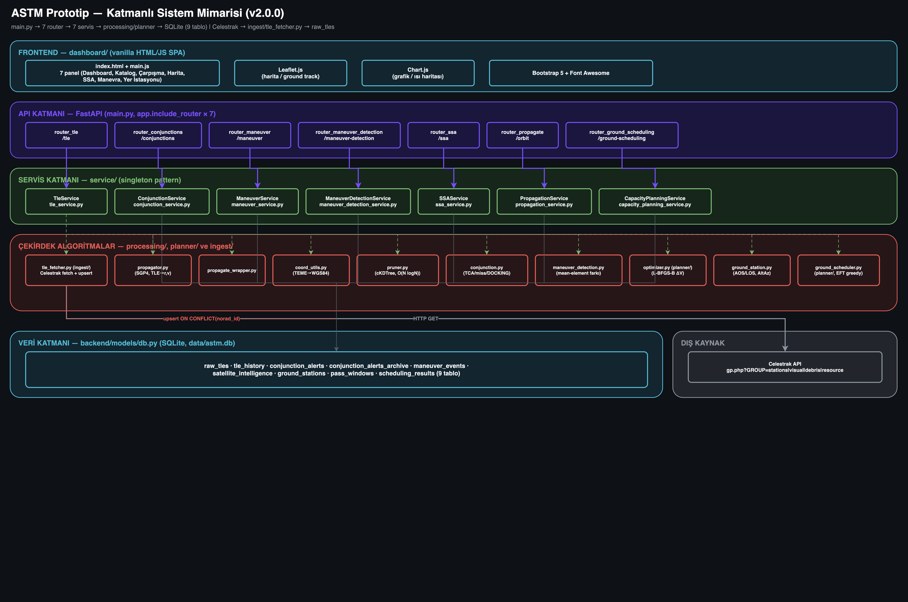
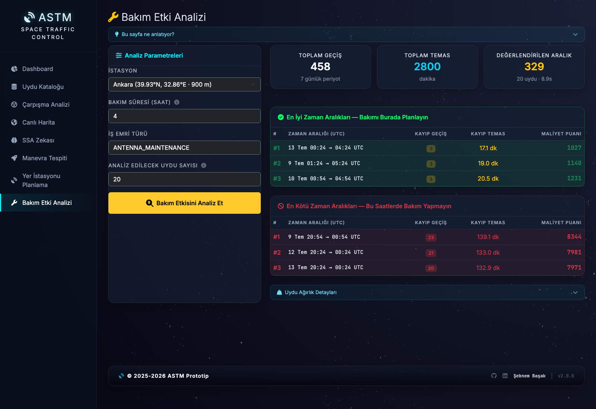
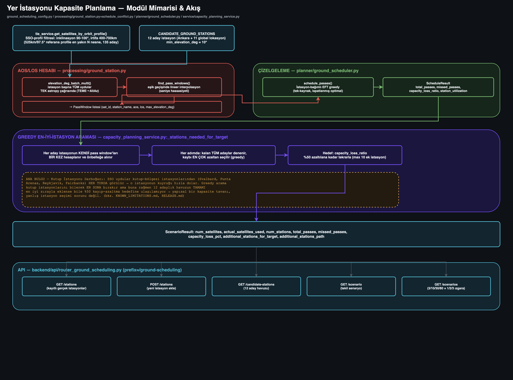
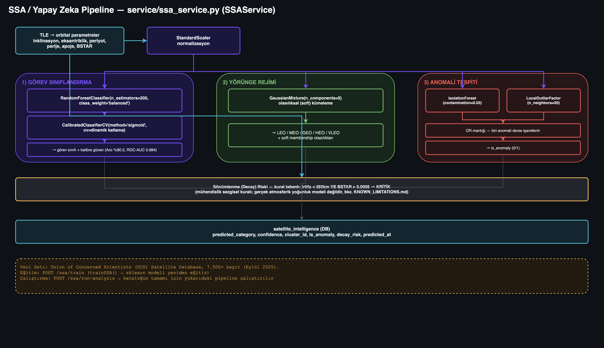
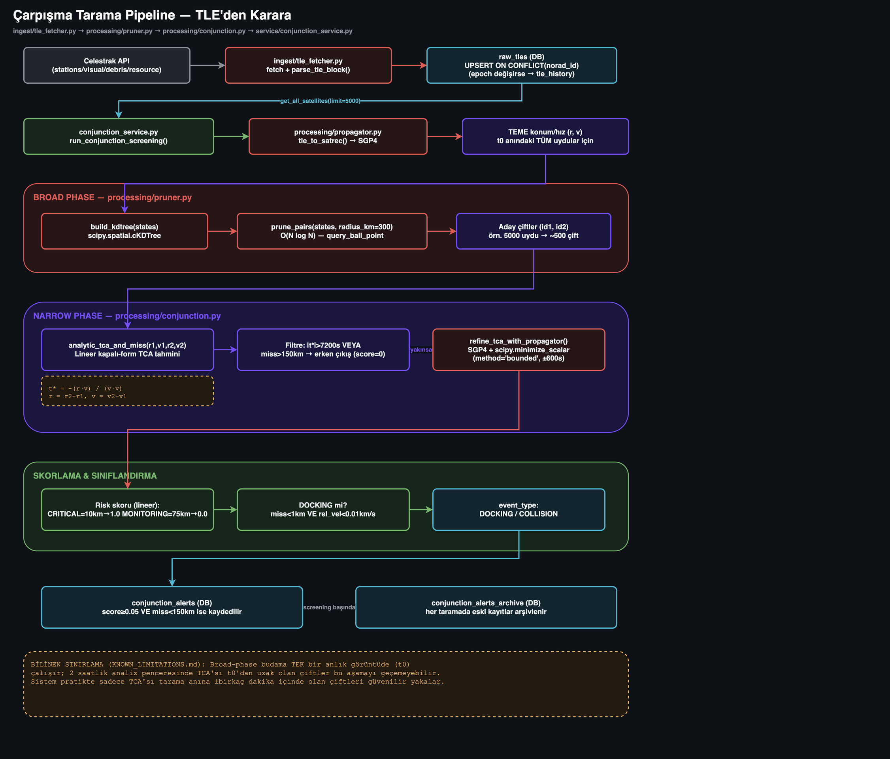
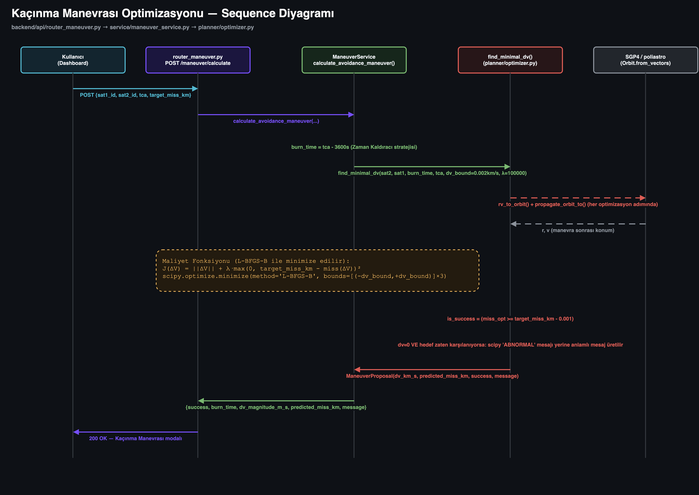
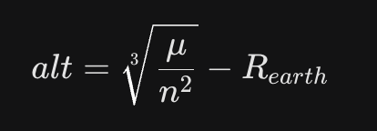

## Mimari Diyagramlar

Aşağıdaki güncel sistem mimarisi, projenin tüm sürümler boyunca eklenen katmanlarını (v2.0.0 itibarıyla) gösterir. 

Diğer modüllere özel diyagramlar ilgili sürüm bölümlerinde ve `docs/Diagrams/` altındadır.

---

# Release Notes - v2.0.0 (Bakım Etki Analizi, Sayfalama, SSA & Conjunction İyileştirmeleri, Dashboard UX Turu)

## Genel Bakış
Bu sürüm dört ana eksende ilerler: (1) yer istasyonu bakım pencerelerinin operasyonel maliyetini hesaplayan yeni bir **Bakım Etki Analizi** modülü, (2) tüm büyük listelerde (uydu kataloğu, CDM, manevra, SSA) **sunucu taraflı sayfalama**, (3) çarpışma tarama ve SSA sınıflandırma algoritmalarında bir dizi doğruluk düzeltmesi, (4) dashboard genelinde bir kullanılabilirlik ve bilimsel şeffaflık turu (açıklama kutuları, sahte göstergelerin kaldırılması, güncel mimari diyagramlar ve ekran görüntüleri).

## Yeni Özellikler

### Bakım Etki Analizi (Maintenance Impact Analyzer)
Yer istasyonu bakım penceresi optimizasyonu — bir bakım çalışması (anten söküm, yazılım güncellemesi vb.) hangi uydu geçişlerini kaybettirir sorusuna cevap verir.

- **`service/maintenance_service.py`:** 1976 US Standard Atmosphere piecewise-exponential atmosfer modeli (150–1000 km, Vallado Tablo 8-4) ile B*'tan yörünge ömrüne (`T_life = 365 × (ρ_CAL/ρ(h)) × (B*_CAL/B*)`, kalibrasyon çıpası: 400km/B*=1e-4/365 gün) dönüşüm; ömre göre ağırlık basamağı (<180 gün → 3.0, 180-365 gün → 2.0, >365 gün → 1.0). 7 günlük ufku 30 dakikalık adımlarla tarayıp her aday bakım penceresi için maliyet puanını (`Σ pass.duration_s × weight`, çakışan geçişler üzerinden) hesaplar.
- **Faz 2 — B* Regresyonu:** B* artık tek bir TLE anlık görüntüsünden değil, `tle_history` tablosundaki geçmiş kayıtlara doğrusal regresyon uygulanarak hesaplanır (en az 3 geçmiş kayıt varsa; yoksa anlık TLE değerine düşer). B*'ın zamanla yükselme trendi, uydunun beklenenden hızlı bozunduğunu ağırlığa yansıtır.
- **Yeni endpoint:** `POST /maintenance/analyze` (`backend/api/router_maintenance.py`) — Pydantic v2 modelleri, `ValueError` → HTTP 422, `RuntimeError` → HTTP 503.
- **Dashboard:** "Bakım Etki Analizi" paneli — istasyon/süre/iş emri/uydu sayısı formu, en iyi (yeşil) ve en kötü (kırmızı) zaman aralığı tabloları, uydu ağırlık detayları (etkin B*, tahmini ömür, ağırlık, B* kaynağı) katlanabilir tablosu.
- **Bug fix:** Dashboard dropdown'unda Konya seçeneği vardı ama `CANDIDATE_GROUND_STATIONS` listesinde yoktu → HTTP 422. `ground_scheduling_config.py`'a Konya eklenerek konfigürasyon tutarsızlığı giderildi (Playwright doğrulamasında yakalandı).
- **Doğrulama:** Ankara 4 saat → 452-458 geçiş, ~2700-2800 dk temas, ~329 pencere değerlendirildi; sıfır kayıplı pencereler "Sıfır Kayıp" rozetiyle işaretleniyor. Konya 4 saat → HTTP 200, ~440 geçiş.

### Sunucu Taraflı Sayfalama
Tüm büyük listeler artık `page` + `limit` parametresi alıp `{items, total, page, pages}` döndürür — önceden tüm kayıtlar tek seferde DOM'a basılıyordu.

| Sayfa | Endpoint | Toplam kayıt |
|---|---|---|
| Uydu Kataloğu | `GET /tle/list` | ~16.000 |
| CDM Çarpışma Uyarıları | `GET /conjunctions/alerts` | ~490 |
| Manevra Tespiti | `GET /maneuver-detection/events` | — |
| SSA Zekası | `GET /ssa/results` | ~16.000 |

Frontend'de Bootstrap yerine uygulamanın cam/neon temasıyla uyumlu, elipsis mantığına sahip (`ilk, son, aktif ±2`) özel bir `renderPagination()` bileşeni kullanılır. Dashboard'daki toplam sayı kartları artık `limit=10000` yerine `limit=1&page=1` ile sadece `total` alanını okuyarak tek kayıt çeker.

### SSA — Celestrak Güncellemesi Sonrası Sınıflandırma Takibi
**Sorun:** Bir Celestrak TLE güncellemesi `raw_tles`'e binlerce yeni uydu eklediğinde `satellite_intelligence` tablosu bunları içermiyordu; yörünge rejimi ısı haritası LEFT JOIN nedeniyle sınıflandırılmamış uyduları gri nokta olarak gösteriyordu.

- Isı haritası sorgusu LEFT JOIN → INNER JOIN'e çevrildi (yalnızca sınıflandırılmış uydular gösterilir, yanıltıcı gri noktalar kalkar).
- Yeni `GET /ssa/status` endpoint'i (`{pending, total}`) — SSA paneli açıldığında bekleyen sınıflandırma sayısını kontrol eder; `pending > 0` ise sarı uyarı banner'ı + "Şimdi Sınıflandır" butonu gösterilir.
- `analyze_all_satellites`, `ucs_database.csv` bulunamadığında boş ülke eşlemesiyle devam eder (artık crash vermez).

### Çarpışma Algoritması İyileştirmeleri
- **GEO_NEIGHBOR kategorisi:** Ortalama hareketi GEO bandında (`< 1.5×(2π/1436)`) ve dış merkezliği düşük (`< 0.01`) nesneler artık yanlışlıkla FORMATION'a değil GEO_NEIGHBOR'a sınıflandırılır (PROBA-3 gibi kasıtlı yüksek eksantrikli formasyon uçuşlarını yanlış eleyen bir kenar durumu düzeltildi).
- **Debris/inaktif kuralı:** İsminde `DEB`/`R`/`B`/`ROCKET`/`STAGE`/`BODY` geçen nesneler artık FORMATION değil COLLISION olarak değerlendirilir (kontrolsüz enkaz kasıtlı formasyon uçuşu olamaz).
- **FORMATION eşiği genişletildi:** Bağıl hız eşiği 0.05 km/s → 0.10 km/s (LEMUR+LEMUR çifti ~66 m/s'de yanlışlıkla COLLISION'a sınıflandırılıyordu).
- **Skor gösterimi:** Risk yüzdesi artık `toFixed(0)` yerine `Math.floor` ile yuvarlanıyor — %99.77 gibi değerlerin yanıltıcı şekilde "%100"e yuvarlanması önlendi.
- **GEO harita hatası:** HISPASAT gibi GEO uydularda haritanın `fitBounds` ile ~0.006° genişliğindeki bbox'a sığdırılması zoom seviyesini 18+'e çekip siyah/boş ekrana yol açıyordu. GEO nesneler (`alt_km > 33000`) artık 200km yarıçaplı kesikli çemberle ve sabit zoom=2 ile gösteriliyor (yörünge polyline'ı yerine).
- **GEO_NEIGHBOR rozeti:** Dashboard'da mor "GEO KOMŞU" etiketiyle ayrı gösteriliyor.

### Yer İstasyonu Harita Düzeltmesi
Sayfalama, `/tle/list`'in düz liste yerine `{items, total, ...}` döndürmesine neden olunca, Yer İstasyonu Planlama haritası `sats.slice(0,15)` çağrısıyla boş dizi üzerinde çalışıp hiç uydu göstermiyordu. `satResp.items ?? satResp` ile geriye dönük uyumlu okuma sağlandı.

## Dashboard UX Turu ve Bilimsel Şeffaflık
- **"Bu sayfa ne anlatıyor?" açıklama kutuları:** Her sayfaya, o sayfadaki teknik terimleri (TCA, SGP4, CDM, BSTAR, Random Forest, GMM, Isolation Forest/LOF, AOS/LOS, greedy arama, B* regresyonu vb.) kendi bağlamında tanımlayan katlanabilir kutular eklendi.
- **Sahte göstergelerin kaldırılması:** Her zaman "OK" dönen `/health` endpoint'ine bağlı sahte "Sistem Sağlığı" kartı kaldırılıp gerçek manevra sayısına çevrildi; hiç yenilenmeyen statik "LIVE" rozeti kaldırılıp Canlı Harita'daki rozet gerçek 1 saniyelik interpolasyon hareketine bağlı dinamik göstergeye çevrildi.
- **Yer İstasyonu Planlama tablosu:** İstasyon seçim sırası artık tooltip yerine doğrudan görünür rozet sütunu (kutup istasyonları ayrı renkte işaretli); stat kartı yükseklik tutarsızlığı (uzun not metni taşması) düzeltildi.
- **`planner/optimizer.py`:** `dv=0` zaten optimal olduğunda scipy L-BFGS-B'nin türevsiz noktada ürettiği ham `"ABNORMAL: "` mesajı, `is_success` kriterine göre anlamlı Türkçe mesaja çevrildi.
- **5 mimari diyagram** (`docs/Diagrams/*.drawio`, koyu+açık tema): sistem mimarisi, çarpışma tarama pipeline, manevra optimizasyonu (sequence), SSA/ML pipeline, yer istasyonu kapasite planlama — doğrudan koda bakılarak hazırlandı, README/RELEASE'in ilgili sürüm bölümlerine gömüldü.
- **20+ yeni ekran görüntüsü** (`docs/Screenshots_v2/`), gerçek backend'e bağlı Playwright otomasyonuyla (mock veri yok) çekildi; eski (Aralık 2025) görüntüler `docs/Screenshots/` altında arşiv olarak korundu.
- **Genel isimlendirme:** Kod ve dokümantasyondaki şirket adına özgü referanslar (Hello Space) genelleştirilip "büyüyen pocketqube/IoT uydu constellation operatörü" ifadesine çevrildi; `HELLO_SPACE_TARGET_*` sabitleri `REFERENCE_ORBIT_*` olarak yeniden adlandırıldı.
- **Footer:** GitHub + LinkedIn bağlantıları, `© 2025-2026`, sürüm etiketi `v2.0.0`.

---

# Release Notes - v1.4.0 (Ground Station Scheduling & Capacity Planning)

> **Ana Bulgu:** SSO/polar yörüngeli, büyüyen küçük uydu constellation'larında kapasite kaybı, istasyon sayısından çok istasyonların coğrafi konumuna bağlı. Kutup-bölgesi istasyonları (örn. Svalbard) SSO uydularını her turda gördüğü için orantısız geçiş yoğunluğu üretir. Rastgele bir istasyon eklemek kaybı azaltmak yerine **artırabilir**. Daha da önemlisi **EN İYİ istasyonu seçen greedy bir arama bile** (12 adaylık havuzdaki tüm seçenekleri en-iyiden-en-kötüye sırayla dener) %50 kayıp-azaltma hedefine ulaşamıyor. Bu yanlış istasyon seçimi sorunundan öte, modelin varsayımları altında yapısal bir kapasite tavanına işaret ediyor. Detay: [Bulgu: Kutup İstasyonu Darboğazı](#bulgu-kutup-istasyonu-darboğazı).

## Genel Bakış
Bu sürüm büyüyen pocketqube/IoT uydu constellation'ları için gerçek bir operasyonel darboğazı modeller. Uydu sayısı arttıkça (3 → 10 → 30 → 80), sınırlı yer istasyonu sayısıyla geçiş pencereleri çakışmaya başlar ve bir istasyon aynı anda yalnızca bir uydudan veri indirebilir. Yeni modül, ASTM'in mevcut SGP4 propagasyon altyapısını yer istasyonu görüş geometrisine (AOS/LOS/elevasyon) genişletir ve bunun üzerine bir çizelgeleme + kapasite planlama katmanı ekler.

## Yeni Özellikler

### Yer İstasyonu Görüş Geometrisi (AOS/LOS)
- **`processing/ground_station.py`:** `processing/propagator.py`'nin ürettiği TEME konum vektörlerinden, bir yer istasyonuna göre topocentric elevasyon açısını hesaplayan `elevation_deg` fonksiyonu eklendi (TEME → ITRS → AltAz dönüşüm zinciri, `coord_utils.teme_pos_to_latlon`'un TEME→ITRS adımıyla aynı astropy altyapısını kullanır — `coord_utils.py` değiştirilmedi, sadece aynı yaklaşım yeni bir dosyada uygulandı).
- **AOS/LOS Tespiti:** `find_pass_windows`, bir zaman aralığını adımlı tarayıp elevasyonun `min_elevation_deg` eşiğini yukarı/aşağı kestiği anları (ardışık örnekler arası lineer interpolasyonla saniye hassasiyetinde) AOS/LOS olarak işaretler; `compute_all_pass_windows` bunu çoklu uydu × çoklu istasyon için toplu çalıştırır.
- Hem `propagate_func` hem `elevation_func` dependency injection ile alınır (`conjunction.py`'deki `propagate_func` injection deseniyle aynı), bu sayede gerçek SGP4/astropy çağrısı yapmadan deterministik test edilebilir.

### Çakışma Tespiti
- **`processing/schedule_conflict.py`:** Aynı istasyonda zaman içinde örtüşen geçiş pencerelerini (`detect_conflicts`) ve çakışmaya taraf olan geçişlerin oranını (`conflict_ratio`) hesaplar.

### Çizelgeleme — İstasyon-Bağımlı EFT Greedy
- **`planner/ground_scheduler.py`:** Her `PassWindow` zaten kendi `station_name`'ine özgü bir geometridir (AOS/LOS o istasyonun lat/lon'una göre hesaplanmıştır). Bir pencere fiziksel olarak başka bir istasyona aktarılamaz. Bu nedenle çizelgeleme istasyon başına bağımsız bir tek-kaynak (single-resource) problemi olarak modellendi. Her istasyonun kendi kuyruğu, geçişleri LOS zamanına göre (Earliest-Finish-Time) sıralayan greedy algoritmle çözülür. Tek kaynak için bu, çakışmasız maksimum geçiş sayısını seçmede ispatlanmış optimaldir (klasik interval scheduling teoremi), ILP/OR-Tools gibi ağır bağımlılıklar gerekmez.
  - **Değerlendirilen ama elenen alternatif:** İlk tasarımda istasyonlar "en az meşgul olana ata" mantığıyla birbirinin yerine geçebilen ortak bir kapasite havuzu olarak modellenmişti. Bu, bir pencerenin (örn. Ankara için hesaplanmış AOS/LOS) fiilen görüş hattı olmayan başka bir istasyona (örn. Svalbard) "ödünç verilmesi" anlamına geldiği için fiziksel olarak tutarsızdı ve düzeltildi.
  - İstasyon sayısının kapasiteyi artırması, çakışmaların istasyonlar arasında dağıtılmasından değil, her yeni istasyonun (farklı coğrafi konumda, dolayısıyla farklı/örtüşen uydu kümesini gören) kendi kuyruğunun küçülmesinden gelir.

### Kapasite Planlama Senaryo Motoru
- **`service/capacity_planning_service.py`:** Büyüme hedefine paralel uydu sayıları (3/10/30/80) × istasyon sayıları (1/2/3) ızgarasını tarayıp her kombinasyon için kapasite kaybı (kaçırılan geçiş oranı) hesaplar.
- **Geriye-doğru hesaplama — Greedy En-İyi-İstasyon Araması:** Her senaryo için, mevcut kapasite kaybını %50 azaltmak için `CANDIDATE_GROUND_STATIONS` havuzundan kaç EK istasyon eklenmesi gerektiğini bulur (`additional_stations_for_target` + seçilen istasyonların sırası `additional_stations_path`). Havuzdaki istasyonları SABİT liste sırasıyla (Ankara→Svalbard→...) deneyen ilk yaklaşım, kutup-bölgesi istasyonlarını (kayıp azaltmak yerine artıran, bkz. aşağıdaki bulgu) "sıradaki" oldukları için seçip yanıltıcı sonuçlar üretebiliyordu; bunun yerine her adımda KULLANILMAMIŞ tüm adaylar tek tek denenip kaybı EN ÇOK azaltan seçilir (greedy). Performans: her adayın kendi pass window'ları bir kere hesaplanıp önbelleğe alınır, greedy adımları sadece ucuz `schedule_passes` karşılaştırması yapar.
- Gerçek TLE verileri `tle_service.get_satellites_by_orbit_profile()` üzerinden okunur — DB'deki tüm katalog (stations/visual/debris/resource) referans yörünge profiline (525km irtifa, 97.5° inklinasyon — SSO) yakınlığa göre filtrelenip sıralanır, alfabetik/rastgele seçim yapılmaz. İstenen sayıdan az uydu bu yörünge bandında mevcutsa mevcut olanlarla devam edilir (`actual_satellites_used` ile raporlanır).

### Veritabanı Şeması
- **Yeni tablolar:** `ground_stations` (kullanıcı tanımlı gerçek istasyonlar), `pass_windows` (hesaplanan AOS/LOS pencereleri), `scheduling_results` (senaryo koşusu çizelgeleme çıktısı, `assigned` bayrağıyla atanan/kaçırılan ayrımı).

### API ve Dashboard
- **Yeni router:** `backend/api/router_ground_scheduling.py` — `/ground-scheduling/stations` (CRUD), `/ground-scheduling/candidate-stations`, `/ground-scheduling/scenario` (tekil), `/ground-scheduling/scenarios` (ızgara).
- **Yeni dashboard paneli:** "Yer İstasyonu Planlama" — Leaflet harita üzerinde aday istasyonlar + canlı uydu konumları, senaryo parametre formu, kapasite kaybı/ek istasyon ihtiyacı stat kartları, Chart.js ile senaryo karşılaştırma grafiği ve tablosu.

## Bulgu: Kutup İstasyonu Darboğazı

Senaryo motoru, referans (planlanan) yörünge profiline — 525km irtifa, 97.5° inklinasyon, güneş-senkron (SSO) — yakın **gerçek** Celestrak nesneleriyle (bkz. [Veri ve Varsayımlar Şeffaflığı](#veri-ve-varsayımlar-şeffaflığı)) çalıştırıldığında, beklenmedik ama fiziksel olarak tutarlı bir sonuç ortaya çıktı:

| Uydu Sayısı | İstasyon Sayısı | Toplam Geçiş | Kaçırılan Geçiş | Kapasite Kaybı |
|:---:|:---:|:---:|:---:|:---:|
| 25 | 1 (Ankara) | 82 | 31 | %37.8 |
| 25 | 2 (+Svalbard) | 352 | 186 | **%52.8** |
| 25 | 3 (+Punta Arenas) | 456 | 228 | %50.0 |
| 80 | 1 (Ankara) | 271 | 148 | %54.6 |
| 80 | 2 (+Svalbard) | 1139 | 835 | **%73.3** |
| 80 | 3 (+Punta Arenas) | 1491 | 1043 | %70.0 |

**Neden:** SSO/polar yörüngeli (97.5° inklinasyon) bir uydu, kutup bölgesine yakın bir istasyondan (örn. Svalbard, 78°N) **her turda** (günde ~10-15 kez) görülür, çünkü yörüngenin yer izi her devirde kutuplara yaklaşır. Orta enlemdeki bir istasyon (örn. Ankara, 40°N) ise aynı uyduyu günde sadece birkaç kez görür. Bu yüzden 2. istasyon olarak Svalbard eklendiğinde toplam geçiş talebi orantısızca büyüyor (25 uydu için 82 → 352), ama bu yeni istasyon hâlâ aynı anda yalnızca bir uyduyla ilgilenebilen tek-kaynak bir kuyruk — kendi içinde çok daha sık çakışma yaşıyor ve sistem genelinde kapasite kaybı **artıyor** (%37.8 → %52.8), azalmıyor. 3. istasyon olarak başka bir kutup-bölgesi noktası (Punta Arenas, güney yarım küre) eklenince bu yük ikiye bölünüyor ve kayıp kısmen geriliyor (%52.8 → %50.0) ama yine de tek-istasyon durumunun üzerinde kalıyor.

**Çıkarım:** İstasyon eklemek kapasiteyi otomatik olarak artırmıyor. Yeni istasyon da yüksek-görünürlük (kutup/yarı-kutup) bölgesindeyse, kapasiteden çok **talebi** büyütüp mevcut darboğazı genişletebiliyor. Bunun "yanlış istasyon seçimi" sorunu olmadığını doğrulamak için `CapacityPlanningService._stations_needed_for_target`, havuzu sabit sırayla denemek yerine her adımda **kalan tüm adayları tek tek deneyip kaybı en çok azaltanı seçen** bir greedy arama olarak çalıştırıldı. Sonuç: greedy arama gerçekten doğru çalışıyor — örn. 10 uydu/1 istasyon senaryosunda seçilen sıra `Singapore → Perth → Toronto → Quito → Cape Town → Wellington → Tokyo → Punta Arenas → Reykjavik → Fairbanks` oldu; yani algoritma orta/düşük enlem istasyonlarını önce, kutup-bölgesi istasyonlarını (Punta Arenas, Reykjavik, Fairbanks) bilerek EN SONA bırakıyor. Buna rağmen **12 adaylık havuzun tamamı en iyi sırayla eklense bile** hiçbir senaryoda (3 uydu hariç) %50 kayıp-azaltma hedefine ulaşılamadı (`additional_stations_for_target=None`). Bu, basit coğrafi istasyon ekleme stratejisinin (en iyi seçimle bile) yeterli olmadığını, farklı bir yer-segmenti stratejisinin (örn. yüksek-verim/çoklu-anten istasyonlar, inter-satellite link, veya kutup-bölgesinde kapasite yoğunlaştırma) gerekebileceğini düşündürüyor — ancak bu bir hipotez/ileri-bakış gözlemidir, kesin bir çözüm değildir.

**Gerçek dünya emsali:** SSO ağırlıklı yer gözlem constellation'ı işleten operatörler bu nedenle tipik olarak kutup/yarı-kutup bölgesinde birden fazla yer istasyonuna veya yüksek-verim (çoklu anten / X-band) yer segmentine yatırım yapar. Kutup bölgesi SSO geçiş yoğunluğunun doğal bir sonucu olarak endüstride bilinen bir kapasite planlama deseni. Bu genel bir gözlemidir, spesifik bir akademik kaynak/sayısal referans verilmemiştir, kesin bir iddia olarak okunmamalıdır.

**Modelin sınırları:** Bu sonuç, modelin varsayımları (10° minimum elevasyon, istasyon başına tek-kanal indirme kapasitesi, 12 aday lokasyon, 24 saatlik pencere) altında geçerlidir. Gerçek elevasyon eşiği, çoklu-anten/çoklu-kanal istasyon mimarisi, veya daha geniş aday istasyon havuzuyla sonuç değişebilir. Bu analiz kesin bir imkansızlık iddiası değil, basit coğrafi istasyon eklemenin tek başına yeterli olmayabileceğine işaret eden bir karar-destek gözlemidir.

## Veri ve Varsayımlar Şeffaflığı
| Parametre | Değer/Kaynak | Etiket | Not                                                                                                                                                                                                                                                                          |
|---|---|---|------------------------------------------------------------------------------------------------------------------------------------------------------------------------------------------------------------------------------------------------------------------------------|
| TLE verisi (line1/line2) | Celestrak `stations`/`visual`/`debris`/`resource` grupları, canlı HTTP fetch (`ingest/tle_fetcher.py`) | **Gerçek veri** | Sentetik/rastgele üretim yok; ham TLE metni DB'de saklanıyor                                                                                                                                                                                                                 |
| Senaryolardaki uydu seçimi (25/80 vb.) | DB'deki gerçek TLE kataloğundan, 525km/97.5° SSO referans profiline inklinasyon+irtifa bandıyla (90-100°, 400-700km) filtrelenip en yakın N nesne (`tle_service.get_satellites_by_orbit_profile`) | **Gerçek veri, profile-eşleştirmeli seçim** | Bu nesneler operatörün kendi (henüz fırlatılmamış) constellation'ı DEĞİL — gerçek yörünge fiziğine sahip, benzer geçiş istatistiği üreten gerçek-dünya SSO yer-gözlem nesneleri (80'lik sette fiilen yer alanlardan örnekler: SkySat, SAOCOM, Cartosat, COSMO-SkyMed ailesi) |
| İstasyon koordinatları (`CANDIDATE_GROUND_STATIONS`) | Gerçek şehir/bölge lat-lon değerleri (Ankara, Svalbard, Punta Arenas, vb.) | **Gerçek koordinat, varsayımsal aday havuzu** | Bu noktalarda fiilen kurulu bir operatöre ait/üçüncü-parti yer istasyonu olduğu iddia edilmiyor; küresel kapsama çeşitliliği için seçilmiş temsili adaylar                                                                                                                   |
| `DEFAULT_MIN_ELEVATION_DEG = 10°` | Tüm istasyonlarda sabit eşik | **Mühendislik varsayımı (endüstri tipik aralığı)** | 5-15° aralığı SATCOM link bütçesi pratiğinde yaygın (düşük elevasyonda atmosferik atenüasyon/multipath artar, bkz. ITU-R P.618 atmosferik yayılım önerileri); gerçek bir operatör link bütçesiyle kalibre edilmemiştir                                                       |
| `DEFAULT_STATION_ALT_KM = 0.0` | Tüm istasyonlar deniz seviyesi kabul ediliyor | **Mühendislik basitleştirmesi** | Gerçek istasyon irtifaları elevasyon hesabını ~0.01-0.1° düzeyinde değiştirir, ihmal edilebilir düzeyde ama gerçek değer değil                                                                                                                                               |
| `DEFAULT_PASS_SCAN_STEP_SECONDS = 60` | AOS/LOS tarama adımı | **Mühendislik varsayımı (performans/hassasiyet dengesi)** | Lineer interpolasyonla saniye hassasiyetine getiriliyor; geçiş pencereleri dakikalar sürdüğü için yeterli                                                                                                                                                                    |
| Senaryo süresi (24 saat) | Sabit pencere | **Mühendislik varsayımı** | Günlük operasyon döngüsünü temsil eden gerçekçi ama varsayımsal seçim                                                                                                                                                                                                        |
| `SCENARIO_SATELLITE_COUNTS = [3, 10, 30, 80]` | Tipik bir büyüme eğrisi varsayımı | **Mühendislik/iş varsayımı** | Belirli bir operatörün doğrulanmış gerçek yol haritası sayıları değilse varsayımsaldır                                                                                                                                                                                       |

## Test Altyapısı
- **`tests/test_ground_scheduling.py`:** 14 deterministik test — `elevation_deg` için bilinen geometrik noktalarla (tepe noktası, antipod) doğrulama; `find_pass_windows` için sahte `propagate_func`/`elevation_func` enjeksiyonuyla AOS/LOS + lineer interpolasyon doğruluğu; `detect_conflicts`/`conflict_ratio` için bilinen çakışma senaryoları; `schedule_passes` için EFT-greedy doğruluğu ve istasyonlar arası izolasyonun (bir pencerenin asla yanlış istasyona atanmadığının) doğrulanması.
- **`tests/test_capacity_planning_service.py`:** 3 deterministik test — `_stations_needed_for_target`'ın greedy seçiminin SABİT liste sırasını değil gerçek kayıp-azaltma etkisini takip ettiğini (en kötü aday listede önce olsa bile en iyi adayın seçildiğini), hedefe ulaşılamadığında tüm adayların en-iyiden-en-kötüye doğru tüketildiğini, ve sıfır kayıp durumunda hesaplama yapılmadan kısa-devre döndüğünü `compute_all_pass_windows`/`CANDIDATE_GROUND_STATIONS` mock'lanarak doğrular.

## Performans
- **Astropy batch optimizasyonu:** `compute_all_pass_windows`, istasyon başına TÜM uyduların TEME konumlarını TEK bir astropy `transform_to` çağrısında batch'ler (`elevation_deg_batch_multi`, `processing/ground_station.py`) — önceden her (uydu, istasyon) çifti için ayrı astropy çağrısı yapılıyordu, bu da sabit ~0.38s/çağrı ek yük taşıyordu. Ölçülen etki: 80 uydu × 1 istasyon için ~30s → ~4.8s (~7x); tam senaryo ızgarası (3/10/30/80 × 1/2/3, greedy istasyon araması dahil) ~25-30 dakikadan **~4 dakikaya** indi. Sonuçlar eski yöntemle bit-bit doğrulandı, davranış değişikliği yok.

---

# Release Notes - v1.3.0 (Manevra Tespiti, SSA Model İyileştirmeleri & Test Altyapısı)

## Genel Bakış
Bu sürüm TLE zaman serisinden tespit eden yeni bir modül, SSA kümeleme/anomali/güven kalibrasyonu algoritmalarında üç ayrı iyileştirme, çekirdek uzay mekaniği modülleri için ilk unit test paketi ve iki dashboard düzeltmesi içerir.

## Yeni Özellikler

### Manevra Tespiti (Faz 3)
- **Mean-Element Farkı Yöntemi:** `processing/maneuver_detection.py` — ardışık iki TLE'nin mean orbital elementleri (yarı-büyük eksen, eğim, dış merkezlik) doğrudan (propagation yapılmadan) karşılaştırılır; bu elementler faz/mean-anomaly'den bağımsız olduğu için saatler/günler arayla alınmış TLE çiftlerinde de güvenilir sonuç verir.
  - **Terk edilen ilk yaklaşım:** SGP4 ile `tle_before`'u `tle_after`'ın epoch'una ilerletip ham hız vektörlerini (artık-hız/residual velocity) karşılaştırmak gerçek verilerde fiziksel olarak anlamsız sonuçlar üretti (54 saat arayla gerçek bir ISS TLE çiftinde, manevra olmamasına rağmen 3.58 m/s artık hız hesaplandı — orbital hızın (~7.6 km/s) mertebesinde sahte sinyal).
  - Δa'dan tanjantsal (irtifa) ΔV, Δi'den normal (düzlem değişimi) ΔV dairesel yörünge yaklaşımıyla türetilir; toplam ΔV bu iki bileşenin vektörel toplamıdır.
  - Manevra tipleri: `ALTITUDE_CHANGE`, `INCLINATION_CHANGE`, `ECCENTRICITY_CHANGE`, `ORBIT_ADJUSTMENT`, `COMBINED`.
- **Yeni tablo:** `maneuver_events` (`norad_id, epoch_before, epoch_after` üzerinde `UNIQUE` index ile tekrar taramalarda çift kayıt önlenir).
- **Yeni endpointler:** `POST /maneuver-detection/run`, `GET /maneuver-detection/events`.
- **Dashboard:** "Manevra Tespiti" paneli — tip, Δa/Δi/Δe, tahmini ΔV ve güven skorunu listeleyen tablo.

## SSA Model İyileştirmeleri (Faz 4-5)

- **Kümeleme — K-Means → Gaussian Mixture Model:** `service/ssa_service.py` — K-Means'in sert (hard) küme sınırları yerine GMM, rejim sınırındaki uydular için olasılıksal (soft) küme ataması yapar. Arayüz (`fit`/`predict`) aynı kaldığı için API/dashboard/DB şemasında değişiklik gerekmedi.
- **Anomali Tespiti — Isolation Forest + Local Outlier Factor Ensemble:** Isolation Forest'ın global/eksen-hizalı bölünmelerle gözden kaçırdığı, yoğun bir kümenin İÇİNDEKİ lokal anormallikleri yakalamak için LOF (`novelty=True`) eklendi; iki yöntemden biri anomali derse nesne işaretlenir (OR mantığı). 170 canlı uydu üzerinde doğrulama: IF tek başına 1, LOF tek başına 21 ek anomali yakaladı (toplam ~%13, önceki ~%3'ten yüksek — kaçırılan gerçek bir anomalinin maliyeti fazladan bir uyarıdan yüksek olduğu için bilinçli tasarım).
- **Confidence Kalibrasyonu:** Random Forest'ın ham `predict_proba` çıktıları `CalibratedClassifierCV` (sigmoid, çapraz doğrulamalı) ile kalibre edildi — ağaç tabanlı modeller genellikle aşırı güvenli (overconfident) tahminler üretir. Çapraz doğrulama katlama sayısı en nadir sınıfın eğitim setindeki örnek sayısına göre dinamik sınırlandırılır (yetersizse kalibrasyonsuz devam edilir). Sonuç: Doğruluk %89.3→%90.2, ROC-AUC 0.979→0.984.
- **Not (uygulanmadı):** LightGBM ile model benchmark'ı planlanmış ancak macOS'ta eksik `libomp` (OpenMP) sistem bağımlılığı nedeniyle ertelendi; mevcut Random Forest + kalibrasyon hattı korunmuştur.

## Test Altyapısı

- **İlk unit test paketi:** `tests/test_conjunction.py` (10 test), `tests/test_optimizer.py` (8 test) — daha önce hiç testi olmayan çarpışma analizi (`processing/conjunction.py`) ve manevra optimizasyonu (`planner/optimizer.py`) modülleri için toplam 18 deterministik test. Gerçek SGP4/poliastro çağrıları yerine doğrusal hareket varsayan sahte (mock) propagator fonksiyonları kullanılarak el ile doğrulanabilir kapalı-form sonuçlar (çarpışma, paralel hareket, kenetlenme/docking sınıflandırması vb.) üzerinden çalışır.

## Dashboard Düzeltmeleri

- **Manevra Tespiti paneli düzeni:** SSA panelindeki bir HTML div etiketinde fazladan kapanış nedeniyle `.main-content` kapsayıcısı erken kapanıyor, bu da Manevra Tespiti panelinin ve footer'ın sidebar düzeninin tamamen dışına (sayfanın çok altına) taşmasına yol açıyordu. Etiket dengesizliği düzeltildi.
- **Yörünge yenileme:** Haritadaki canlı takip, 100 dakikalık hesaplama penceresinin sonuna ulaştığında uydu işaretçisi son noktada donuyordu (yeni veri çekilmiyordu). Son noktaya 10 saniye kala arka planda yeni bir 100 dakikalık pencere otomatik çekilip yörünge çizgisi/işaretçi güncelleniyor.

---

# Release Notes - v1.2.0 (Core Fixes & Data Integrity)

## Genel Bakış
Bu sürümde yeni özellik eklenmemiştir. Temel algoritma hataların düzeltildi, veri katmanını sağlamlaştırıldı ve işlevselliği genişletildi.

## Düzeltmeler ve İyileştirmeler

### Faz 1 — Çekirdek Algoritma Hataları

| Çarpışma Tarama Pipeline | Manevra Optimizasyonu (Sequence) |
|---|---|
|  |  |

- **propagate_satrec_single** artık `(r, v)` tuple döndürüyor. Önceki sürümde hız vektörü atılıyor, tüm çağrı noktaları sonuç olarak 2× SGP4 çağrısıyla finite difference hesaplıyordu. `conjunction.py`, `conjunction_service.py`, `optimizer.py` güncellendi.
- **SSA özellik uyumsuzluğu giderildi.** `input_raw` içinde `alt` iki kez yazılıyordu (`[incl, ecc, period, alt, alt]`). Artık gerçek `perigee` ve `apogee` ayrı hesaplanıp modele veriliyor; HEO uydularında ML doğruluğu düzeldi.
- **Kırılgan BSTAR parser silindi.** Negatif ve sıfır değerlerde yanlış sonuç veren özel parser kaldırıldı, `tle_to_satrec().bstar` kullanılıyor.

### Faz 2 — Veri Katmanı Bütünlüğü
- **TLE duplikasyonu giderildi.** Her `/tle/refresh` çağrısında aynı uydu tekrar INSERT ediliyordu. `raw_tles` tablosuna `norad_id` sütunu ve `UNIQUE` index eklendi; `ON CONFLICT(norad_id) DO UPDATE` ile upsert yapılıyor. Mevcut veritabanları için migration otomatik çalışıyor.
- **`epoch` alanı artık dolu.** TLE Line 1 `[18:32]` konumundan parse edilerek ISO 8601 formatında kaydediliyor.

### Faz 3 — İşlevsellik Genişletme
- **Multi-group TLE fetch.** Yalnızca `stations` grubu (~500 nesne) çekiliyordu. `fetch_and_store()` artık `stations + active + debris` gruplarını iterate ediyor (~8000+ nesne). Bir grup hata verirse diğerleri atlanmaz.
- **Uyarı arşivleme.** Her conjunction taramasında `conjunction_alerts` tablosu tamamen siliniyordu. Yeni `conjunction_alerts_archive` tablosuna `archived_at` damgasıyla taşındıktan sonra siliniyor; geçmiş uyarılar korunuyor.

### Faz 4 — Temizlik ve Güvenlik
- **`skyfield` bağımlılığı kaldırıldı.** `requirements.txt`'te tanımlıydı ancak hiçbir yerde import edilmiyordu.
- **CORS yapılandırılabilir hale getirildi.** `allow_origins=["*"]` production için güvensizdi. Artık `ALLOWED_ORIGINS` env değişkeninden okunuyor (virgülle ayrılmış liste); değişken set edilmezse geliştirme kolaylığı için `["*"]` kalıyor.

---

# Release Notes - v1.1.0 (SSA Intelligence Update)

## Genel Bakış
Bu sürüm, ASTM platformuna **Uzay Durum Farkındalığı (SSA)** yeteneklerini getiren kapsamlı bir Yapay Zeka güncellemesidir. Artık sistem sadece uyduların nerede olduğunu değil, **ne amaçla orada olduklarını** ve **normal davranıp davranmadıklarını** analiz edebilmektedir.

## Teknik Spesifikasyonlar

### 1. Yörünge Mekaniği ve Fiziksel Parametreler
Sistem, ham TLE (Two-Line Element) verilerinden türetilen fiziksel büyüklükleri temel alır.

- **İrtifa (Altitude) Hesaplaması:** Uydunun ortalama irtifası, Kepler'in Üçüncü Yasası'ndan türetilen aşağıdaki formülle hesaplanmaktadır:
    
  - Burada μ (mu) (Dünya'nın kütleçekim parametresi) 398600.44 km^3/s^2, 
  - n radyan/saniye cinsinden ortalama hareket (Mean Motion)
  - R_earth ise 6378.137 km olarak kabul edilmiştir.

- **BSTAR Sürüklenme Katsayısı:** TLE Line 1 içerisinden ayrıştırılan bu değer, uydunun atmosferik dirençten ne kadar etkilendiğini ve dolayısıyla yörünge ömrünü (decay) belirlemede kullanılır.

- **Yörünge Sönümlenme (Decay) Riski:** Alçak yörünge uyduları için irtifanın 350 km altına düşmesi ve BSTAR değerinin 0.0005 eşiğini geçmesi "KRİTİK RİSK" olarak sınıflandırılır.

### 2. Makine Öğrenmesi
Analiz servisi, üç farklı makine öğrenmesi paradigmasını birleştirir:

**Random Forest (Görev Tahmini):**
Yörünge parametreleri (eğim, basıklık, irtifa) ile görev amaçları arasındaki ilişki doğrusal değildir. Örneğin; meteoroloji uyduları ile istihbarat uyduları benzer irtifalarda (LEO) bulunsa da eğim (inclination) değerleri belirgin şekilde ayrışır. Random Forest, bu karmaşık karar ağaçlarını modellemede yüksek başarı gösterir.

**Isolation Forest (Anomali Tespiti):**
Uzaydaki anomali nesneleri, veri setinin çok küçük bir kısmını oluşturur. Isolation Forest algoritması, veriyi rastgele bölerek "aykırı" olanları (outliers) izole eder. Sistemde %3 kirlilik `(contamination=0.03)` oranıyla normal dışı hareket eden nesneler saptanır.

**K-Means (Yörünge Rejimi Kümeleme):**
Uyduları coğrafi veya politik etiketlerden bağımsız, sadece fiziksel yerleşimlerine göre gruplandırmak için kullanılır. Sistem, uyduları 5 ana yörünge rejimine (LEO, MEO, GEO, HEO, VLEO) otomatik olarak kümelere ayırır.

* **Veri Seti:** Union of Concerned Scientists (UCS) Satellite Database (son güncelleme Eylül 2025).
* **Özellik Mühendisliği (Feature Engineering):** `Inclination`, `Eccentricity`, `Period`, `Perigee`, `Apogee` parametreleri üzerinde `StandardScaler` normalizasyonu.
    * TLE Line 1 üzerinden `BSTAR` (sürüklenme katsayısı) ayrıştırma algoritması.
* **Hiperparametreler:**
    * **RF Classifier:** Görev türü tahmini için 200 karar ağacı (`n_estimators=200`).
    * **Isolation Forest:** %3 kirlilik (`contamination=0.03`) oranıyla anomali tespiti.
    * **K-Means:** 5 ana yörünge katmanı için kümeleme.

### 3. Backend Geliştirmeleri
* **Veritabanı Şeması:** `satellite_intelligence` tablosu eklenerek AI tahminlerinin kalıcılığı (persistence) sağlandı.
* **Asenkron Analiz:** Binlerce uyduyu saniyeler içinde analiz eden toplu işlem (batch processing) entegre edildi.
* **Yeni Endpointler:**
    * `POST /ssa/train`: Modeli canlı verilerle yeniden eğitir.
    * `GET /ssa/performance-report`: Modelin teknik başarı metriklerini (JSON) döner.

### 4. Kullanıcı Arayüzü (UI)
* **SSA Dashboard:** Uyduların görev tahminlerini ve güven skorlarını gösteren yeni panel.
* **Radar Chart:** Modelin kapasitesini (Precision, Recall, AUC) görselleştiren dinamik grafik.
* **Isı Haritası:** Sınıflandırma hatalarını gösteren Confusion Matrix entegrasyonu.
### 5. Kullanım
Veri setini indirip `data/ucs_database.csv` olarak kaydetmeniz yeterlidir.
`https://www.kaggle.com/datasets/mexwell/ucs-satellite-database/data`

> Projenin bilinen sınırlamaları ve endüstri standardı olmayan eşik değerleri için bkz. [KNOWN_LIMITATIONS.md](KNOWN_LIMITATIONS.md).

